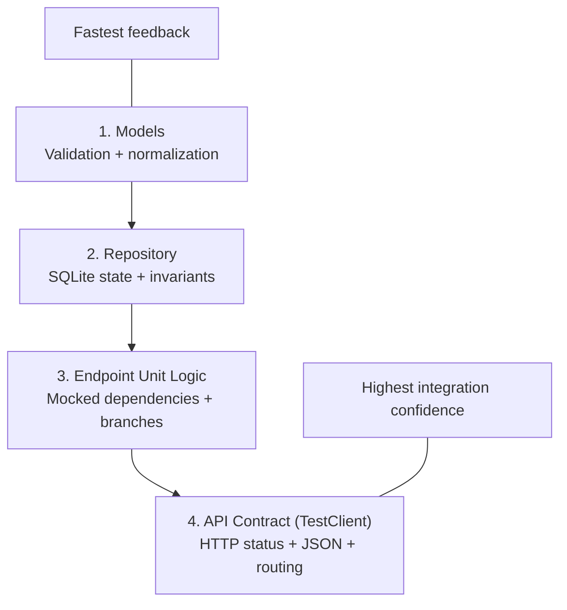

# Testing Scope Guide (`slim_epc_v2`)

Use this as guidance for designing tests by layer.  
It describes **what to test** and **which order to follow**, without prescribing exact test cases.

## Testing Layers

## What Each Layer Can Cover

- **Models (`epc/models.py`)**
  - field ranges, protocol constraints, cross-field validation
  - throughput conversion to canonical `target_bps`
  - default model state

- **Repository (`epc/db.py`)**
  - attach/get/list/detach UE flows
  - bearer add/remove behavior
  - invariants (default bearer `9`, cannot delete `9`)
  - persisted updates (`update_bearer`, `update_stats`) and reset behavior

- **Endpoint unit logic (`epc/api.py`, direct function calls)**
  - success and failure branches per handler
  - mapping `ValueError -> HTTPException(400)`
  - behavior depending on mocked repo/traffic-manager state
  - aggregation decisions in `/ues/stats`

- **API contract (`TestClient`)**
  - HTTP method/path wiring
  - request/response shape and status codes (`200/400/422`)
  - route-level behavior and end-to-end state transitions through API calls

## Recommended Path for Writing Tests

1. Start with **models** (fastest and simplest feedback loop).
2. Add **repository** tests (core business state rules).
3. Add **endpoint unit** tests with mocks (branch-level logic).
4. Finish with **TestClient** tests (public API contract).

This order moves from isolated logic to integration behavior and keeps test design manageable.
